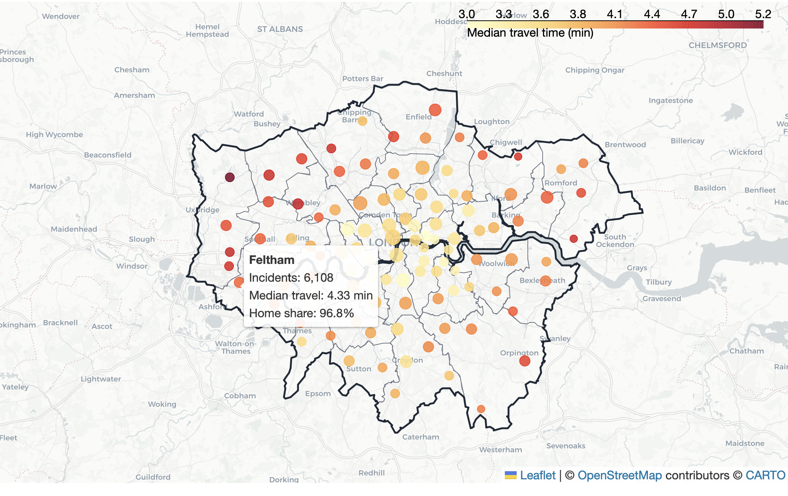
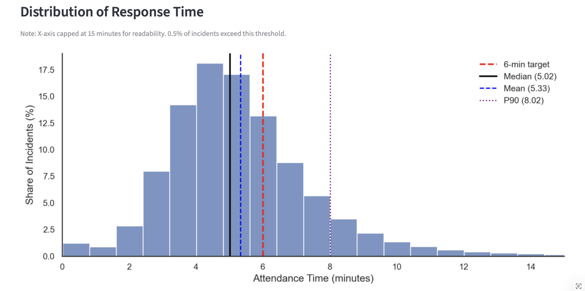

# London Fire Brigade Response Time Analysis (2021–2025)


An interactive dashboard analysing operational response performance across London.

**Key insight:** Borough area drives most variation in response performance through travel time. Turnout time remains nearly constant across all stations.

**[Live Dashboard →](https://lfb-response-time-dashboard-cqk7jfyroyw9dfkfbcj9w5.streamlit.app/)**

---

## Project Overview

The London Fire Brigade operates against two official performance benchmarks for the first appliance:
- First pump arriving within **6 minutes**
- 90% of first pumps arriving within **10 minutes**

A separate 8-minute target exists for the second appliance. However, with the second pump deployed in only 36% of incidents, reflected in a 64% missing value rate for second pump attendance times. It therefore does not provide a consistent basis for cross-incident comparison and was excluded from this analysis.

Adherence to first appliance targets is examined across time periods, incident types, and geographies, alongside the structural factors driving variation in response performance.

**Core finding:** Geography is the main driver of performance variation. Borough area explains 59% of the variation in median response time and 62% of the variation in 6-minute compliance. Travel time accounts for approximately 77% of total response time, while turnout time remains remarkably stable across all boroughs (IQR: just 4 seconds).

---
## Dashboard Preview

### Station Coverage and Deployment Patterns



**Fig. 1.** *Fire station coverage across London. Circle size represents the number of incidents attended by each station and colour indicates median travel time. Tooltip shows station-level deployment metrics.*

### Response Time Distribution



**Fig. 2.**  *Distribution of first-pump response times across incidents. Vertical lines indicate the median, mean, 90th percentile, and the official 6-minute response target.*

## Dashboard Pages

| Page | Description |
|------|-------------|
| **Introduction** | Project context, research questions, and dashboard structure |
| **Executive Summary** | City-wide KPIs, response time distribution, and performance overview |
| **Incident Composition** | Breakdown by incident type, seasonal patterns, and hourly demand heatmap |
| **Response Performance** | Compliance rates by incident type, month, and hour of day |
| **Geographic Performance** | Borough-level choropleth maps for response time, compliance, and incident volume |
| **Drivers of Response Time** | Turnout vs. travel time decomposition, hourly variation, and delay code analysis |
| **Key Findings & Implications** | Summary of findings, operational implications, study limitations, and further outlook |
| **Scenario Explorer** | Interactive what-if tool: simulate uniform travel time reductions per borough and recalculate 6-minute compliance directly from incident-level data |

All descriptive pages update dynamically based on sidebar filters (Year, Month, Incident Type). Scenario Explorer uses full 2021–2025 for maximum sample.

---

## Key Findings

- **Median response time: 5.02 min**, below the 6-minute target at the aggregate level
- **6-minute compliance: 69.5%**, meaning roughly 1 in 3 incidents exceeds the primary target
- **Borough range:** 4.22 min (Kensington & Chelsea) to 6.02 min (Hillingdon), a gap of 1.80 minutes
- **Travel time** accounts for ~77% of total response time, while turnout time is highly consistent (IQR: 4 s)
- **Borough area** explains 59% of response time variation and 62% of compliance variation (r = −0.79)
- **61.6% of all target exceedances** are recorded as "Not held up", meaning no specific operational cause

---

## Interactive Scenario Analysis

The Scenario Explorer page goes beyond descriptive analysis. It simulates how 6-minute compliance would change if travel times were uniformly reduced by a given number of seconds. It uses direct recalculations from the underlying incident level data rather than estimates based on aggregates.

This makes it possible to quantify, for any given borough, how much operational improvement (e.g. from a new station or route optimisation) would be needed to meaningfully shift compliance rates.

---

## Tech Stack

- **Python**: data processing and analysis
- **Pandas / NumPy**: data manipulation and statistical calculations
- **Streamlit**: multi-page interactive dashboard
- **Matplotlib / Seaborn**: static visualisations
- **Plotly**: interactive choropleth maps
- **GeoPandas / Folium**: geographic boundary data and mapping
- **SciPy**: statistical testing (correlation analysis)
- **statsmodels**: OLS regression and statistical modelling

## Data Pipeline

The analysis pipeline consists of three stages:

1. **Data ingestion** – London Fire Brigade incident and mobilisation datasets are downloaded from the London Datastore.
2. **Data preparation** – datasets are cleaned, joined, and filtered to incidents between 2021–2025. Mobilisation records are aggregated to incident level using the first pump arrival.
3. **Spatial enrichment** – station coordinates are joined with borough boundaries to analyse station coverage and cross-borough deployments.

Processed datasets are exported to compressed **Parquet (Snappy)** format for fast loading in the Streamlit dashboard.

---

## Project Structure

```
lfb-response-time-dashboard/
│
├── Introduction.py                         # Entry point
├── data_loader.py                          # Cached data loading and preprocessing
├── pages/
│   ├── 1_Executive_Summary.py
│   ├── 2_Incident_Composition.py
│   ├── 3_Response_Performance.py
│   ├── 4_Geographic_Performance.py
│   ├── 5_Drivers_of_Response_Time.py
│   └── 6_Key_Findings_&_Implications.py
├── Data/
│   ├── lfb_streamlit.parquet
│   ├── london_boroughs/                    # GeoJSON boundary files
│   └── london_population_borough.csv
├── analysis/
│   └── London_Fire_Brigade_Analysis.ipynb  # EDA and preprocessing notebook
├── .streamlit/
│   └── config.toml                         # Theme configuration
├── requirements.txt
└── README.md
```

---

## Running the App Locally

```bash
pip install -r requirements.txt
streamlit run Introduction.py
```

---

## Data Sources

Two publicly available datasets from the London Fire Brigade, accessed via the London Datastore were used.

- **LFB Incident Records** — [data.london.gov.uk](https://data.london.gov.uk/dataset/london-fire-brigade-incident-records)
- **LFB Mobilisation Records** — [data.london.gov.uk](https://data.london.gov.uk/dataset/london-fire-brigade-mobilisation-records)

Geographic boundary data (GIS borough boundaries) was sourced from the [London Datastore Statistical GIS Boundary Files](https://data.london.gov.uk/dataset/statistical-gis-boundary-files-for-london-20od9/).

### Fire station locations (station coverage map)

Station coordinates were sourced from the Open Data Institute (ODI) Fire and Rescue Analysis repository:

- Repository: https://github.com/theodi/FNR_Analysis  
- File used: https://raw.githubusercontent.com/theodi/FNR_Analysis/refs/heads/master/data/preprocessed/stations.csv  
- ODI project context (station closure impact tool): https://theodi.org/project/tools-developing-tools-to-assess-the-impact-of-fire-station-closures/

The ODI station list reflects the pre-2014 London Fire Brigade station network. In January 2014, ten stations were closed as part of the Fifth London Safety Plan, reducing the total number of stations from 112 to 102.

The ODI file contains 113 station entries, which differs slightly from commonly reported counts (e.g., 112). This discrepancy likely reflects differences in how specialist or non-standard units (e.g., river/support stations) are represented in station inventories.

For this project, station coordinates are used for **spatial visualisation** only. Operational metrics are derived from the London Fire Brigade incident and mobilisation datasets and are calculated on the filtered 2021–2025 subset after joining the raw annual files.

Station coverage metrics were generated via `analysis/prepare_station_coverage.py`, which links station coordinates to borough boundaries and aggregates station deployment patterns from the filtered incident data.

The full data preprocessing and exploratory analysis pipeline is documented in [`analysis/London_Fire_Brigade_Analysis.ipynb`](analysis/London_Fire_Brigade_Analysis.ipynb).

## Analysis Notebook

The [`analysis/London_Fire_Brigade_Analysis.ipynb`](analysis/London_Fire_Brigade_Analysis.ipynb)
contains the full analytical pipeline and is the methodological foundation for all
dashboard findings.

**Structure:**
- **Step 1: Data Exploration:** Separate inspection of both raw datasets (Incidents and
  Mobilisation), including distribution analysis, variable classification, and metadata review.
- **Step 2: Cleaning & Preprocessing:** Documented missing value strategy per column,
  datetime feature engineering (hour, weekday, month, year), and dataset merge.
- **Step 3: Exploratory Data Analysis:** 10 analytical sections covering incident trends,
  temporal demand patterns, response time distributions, borough-level performance, and
  delay code analysis. Includes a one-way ANOVA (attendance time ~ hour of call) with
  Eta² effect size to quantify time-of-day impact, and OLS regression to identify
  structural drivers of borough-level response time variation.
- **Step 4: Export:** Processed dataset exported to compressed Parquet for the Streamlit
  dashboard.

The notebook documents not just *what* was found, but *why* specific analytical choices
were made — including the exclusion of second pump data (64% missing rate) and the
rationale for using median over mean for response time comparisons.

---

## Author

Andrés Lill · 2026  
